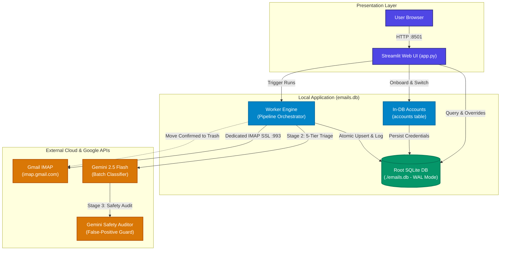

# 📧 Gmail AI Cleaner

> An intelligent, database-driven Gmail cleaner powered by Google Gemini 2.5 Flash. Classify, audit, and clean thousands of marketing emails and spam with multi-layer safety defenses, in-database credential management, a 5-tier AI confidence taxonomy, and an interactive browser-first review center.

[](https://www.python.org/downloads/)
[](https://ai.google.dev/)
[](https://www.sqlite.org/)
[](https://streamlit.io/)
[](https://github.com/tt-a1i/archify)
[](LICENSE)

---

## 🗺️ Interactive System Architecture Map

The system architecture is authored and strictly validated using [Archify](https://github.com/tt-a1i/archify).

An interactive, self-contained HTML architecture map is included directly in this repository:
👉 **[`docs/architecture/system-map.html`](docs/architecture/system-map.html)**

### Viewing the Interactive Map
Open the map directly in your default browser:
```bash
# On macOS:
open docs/architecture/system-map.html

# On Linux:
xdg-open docs/architecture/system-map.html

# On Windows:
start docs\architecture\system-map.html
```

### Interactive Features in the Archify Map
* 🧭 **3 Guided Views**:
  * **Ingestion & AI Pipeline**: Traces the full flow from IMAP fetch, through Stage 2 Gemini triage and Stage 3 Safety Audit, to SQLite persistence.
  * **Root Database & In-DB Auth**: Explores the centralized `./emails.db` storing credentials, cursor validity, and execution run logs.
  * **Two-Stage AI Judgment**: Inspects the dual-model pipeline establishing the 5-tier confidence taxonomy and false-positive rescue guard.
* 🔍 **Camera Controls & Pan/Zoom**: Smooth hardware-accelerated navigation with fit-to-screen (`F`), zoom controls, and reset.
* 🎯 **Semantic Lens & Node Inspection**: Click any component or connection to inspect responsibilities, ports, and metadata.
* 📦 **Zero External Dependencies**: Standalone offline HTML rendered with embedded SVG and styling.

### Architecture Overview Diagram



---

## 🌟 Why Gmail AI Cleaner?

Most open-source email cleaning scripts are monolithic loops that crash when Gmail throttles their IMAP connections or when an LLM hallucinates and deletes an important receipt.

**Gmail AI Cleaner** solves this with a **100% database-driven architecture** built for safety, speed, and granular control:

* 🗄️ **Pure Database-Driven Architecture (`./emails.db`)**:
  * Centralized SQLite database operating in **WAL (Write-Ahead Logging)** mode for rock-solid concurrency.
  * Complete eradication of fragmented `outputs/` directories, loose CSV files, and `state.json`.
  * Every single email, classification verdict, audit rationale, and manual override is durably stored in SQLite.
  * Every pipeline execution is tracked with a unique `run_id` and full timing and volume statistics.
* 👥 **In-Database Multi-Account Management**:
  * Store credentials safely in the SQLite `accounts` table.
  * **1-Click Live Onboarding**: Add new Gmail accounts directly through the web UI with automated SSL handshake and credential verification.
  * **Sidebar Switcher**: Instantly switch between accounts without restarting the server or altering configuration files.
* 🧠 **Granular 5-Tier AI Confidence Taxonomy**:
  * Instead of binary KEEP/DELETE, Gemini 2.5 Flash categorizes emails into 5 calibrated confidence levels:
    * `CONFIDENT_DELETE`: Single-use OTPs, login alerts, mass marketing, promo blasts.
    * `PROBABLE_DELETE`: Inactive newsletters, generic product updates, contest notifications.
    * `NEEDS_REVIEW`: Support tickets, legal/terms updates, ambiguous notices.
    * `PROBABLE_KEEP`: Account setup details, event reminders, community digests.
    * `CONFIDENT_KEEP`: Official tax filings (ITR, Form 16, TDS), monthly bank statements, formal purchase invoices with transaction IDs, flight/train tickets, 1-to-1 recruiter conversations.
  * Rich category tagging: `FINANCIAL`, `INVOICE`, `TRAVEL`, `SECURITY_OTP`, `JOB_ALERT`, `FOOD_TRANSIT`, `MARKETING`, `PERSONAL`, `OTHER`.
* 🛡️ **Two-Stage AI False-Positive Defense**:
  * **Stage 1 (Pre-Protection)**: Starred emails (`\Flagged`) and conversational thread replies (`In-Reply-To` / `References`) are automatically preserved without consuming AI tokens.
  * **Stage 2 (Gemini Classifier)**: Fast, parallelized triage into the 5-tier taxonomy.
  * **Stage 3 (Gemini Safety Auditor)**: Secondary model specifically scrutinizes candidate deletions to rescue financial receipts, tickets, and sensitive communications.
* 🖥️ **Interactive Browser-First Review Center (Streamlit)**:
  * Review candidate deletions directly inside your web browser.
  * 1-Click batch actions: `🛡️ Keep All Needs Review`, `🗑️ Delete All Needs Review`, `✅ Approve Confident Deletes`.
  * Per-email manual overrides and real-time KPI metrics.
* ✅ **Multi-Select Deletion Checklist**:
  * Selective deletion checklist allows choosing exactly which status tiers to trash (`Confident Delete`, `Probable Delete`, `Needs Review`, `Manual Overrides`).
  * Ambiguous `NEEDS_REVIEW` emails are unchecked by default, protecting unreviewed items from accidental deletion.
* ⚡ **Decoupled IMAP Connection Management**:
  * Dedicated single persistent IMAP connection prevents Gmail's `[ALERT] Too many simultaneous connections` 15-connection lockout.
  * AI inference runs concurrently in background worker threads without holding IMAP sockets open.
* 🔄 **1-Click Deterministic Undo**:
  * Trashed emails are never permanently expunged—they are labeled with `\Trash`.
  * Instant restoration matches permanent RFC 822 `Message-ID`s and moves emails back to `\Inbox`.

---

## 📋 Prerequisites

1. **Python 3.9+** installed on your system.
2. **Google App Password**:
   * Enable [2-Step Verification](https://myaccount.google.com/signinoptions/two-step-verification) on your Google Account.
   * Go to [Google App Passwords](https://myaccount.google.com/apppasswords).
   * Enter `Email Cleaner` as the app name and generate a 16-character password (e.g. `abcd-efgh-ijkl-mnop`).
   * *Ensure IMAP is enabled in Gmail: Settings -> Forwarding and POP/IMAP -> Enable IMAP.*
3. **Gemini API Key**:
   * Obtain an API key from [Google AI Studio](https://aistudio.google.com/app/apikey).

---

## 🚀 Quickstart

### 1. Clone the repository
```bash
git clone https://github.com/robinsdeepak/email_cleaner.git
cd email_cleaner
```

### 2. Set up virtual environment & install dependencies
```bash
python3 -m venv .venv
source .venv/bin/activate   # On Windows: .venv\Scripts\activate
pip install -r requirements.txt
```

### 3. Configure credentials
Copy `.env.example` to `.env`:
```bash
cp .env.example .env
```

Open `.env` and fill in your details (used to auto-seed the default account in SQLite):
```env
GMAIL_USER=your_email@gmail.com
GMAIL_APP_PASSWORD=xxxx-xxxx-xxxx-xxxx
GEMINI_API_KEY=AIzaSy...
GEMINI_MODEL=gemini-2.5-flash
```

### 4. Launch the Web Dashboard
```bash
streamlit run app.py
# Or using make:
make ui
```
Open **`http://localhost:8501`** in your browser to access the full review and cleaning suite.

---

## 🖥️ Streamlit Web Dashboard

The web dashboard is organized into 5 purpose-built tabs:

| Tab | Purpose | Key Features |
| :--- | :--- | :--- |
| **1. Overview & Metrics** | Real-time health & statistics | Total emails, Keep vs. Delete breakdown, Needs Review KPI card, category breakdown chart, decision distribution bar chart. |
| **2. Review Center** | Browser-first triage | Filter by Action, AI Status, or Category. 1-click batch approvals (`Approve Confident Deletes`, `Keep All Needs Review`). Expandable email cards with AI rationale. |
| **3. Pipeline Operations** | Step-by-step pipeline runner | Step 1 (Fetch), Step 2 (Scan), Step 3 (Validate), Step 4 (Dry-Run Preview), Step 5 (Multi-Select Gmail Trash Deletion), Step 6 (Undo & Restore). |
| **4. Live Stream Engine** | High-speed pipelined runner | Overlapped IMAP fetch, Gemini AI classification, and continuous SQLite persistence with live progress streaming. |
| **5. Database & Accounts** | Account & data administration | Configured accounts list, default account toggle, CSV export/import utility, and database clean & reset with confirmation guard. |

---

## 🛠️ CLI & Makefile Usage

You can also run all pipeline stages directly from the command line:

### High-Speed Streaming Pipeline
```bash
# Run streaming pipeline for 200 emails
python pipeline.py stream --limit 200

# macOS: Prevent system sleep during long runs
make stream-awake LIMIT=500
```

### Staged Pipeline Execution
```bash
# Execute fetch -> scan -> validate -> revalidate end-to-end
python pipeline.py run-all --limit 200

# Run specific stages
python pipeline.py fetch --limit 100
python pipeline.py scan --workers 10 --batch-size 50
python pipeline.py validate --workers 10
python pipeline.py revalidate
```

### Selective Trashing & Safe Simulation
```bash
# Simulate deletion (Dry-run preview)
python pipeline.py dry-run

# Selective live deletion by status category
python pipeline.py delete --statuses CONFIDENT_DELETE PROBABLE_DELETE

# Move all confirmed deletions to Gmail Trash
python pipeline.py delete
```

### Deterministic Undo & Restoration
```bash
# Search Trash by Message-ID and restore back to Inbox
python pipeline.py restore
# Or via make:
make undo
```

### Database & Pipeline Diagnostics
```bash
# View execution history, run IDs, and duration stats
python pipeline.py runs --limit 20

# Test active Gemini API rate limits
make test-limits

# Clean and reinitialize database
python pipeline.py db-clean
```

---

## 🗂️ Database Schema (`./emails.db`)

All state is durably managed in SQLite:

```sql
-- Configured Accounts & IMAP Credentials
CREATE TABLE accounts (
    email               TEXT PRIMARY KEY,
    display_name        TEXT,
    app_password        TEXT NOT NULL,
    is_default          BOOLEAN DEFAULT 0,
    last_uid_scanned    INTEGER DEFAULT 0,
    uid_validity        INTEGER DEFAULT 0,
    last_fetched_at     TIMESTAMP,
    total_scanned       INTEGER DEFAULT 0,
    created_at          TIMESTAMP DEFAULT CURRENT_TIMESTAMP,
    updated_at          TIMESTAMP DEFAULT CURRENT_TIMESTAMP
);

-- Comprehensive Email Registry with 5-Tier AI Verdicts
CREATE TABLE emails (
    account             TEXT NOT NULL,
    uid                 INTEGER NOT NULL,
    message_id          TEXT,
    sender              TEXT,
    subject             TEXT,
    date                TEXT,
    snippet             TEXT,
    is_starred          BOOLEAN DEFAULT 0,
    is_thread_reply     BOOLEAN DEFAULT 0,
    status              TEXT DEFAULT 'PENDING',        -- CONFIDENT_DELETE, PROBABLE_DELETE, etc.
    confidence          TEXT,                          -- HIGH, MEDIUM, LOW
    category            TEXT,                          -- FINANCIAL, INVOICE, TRAVEL, etc.
    reason              TEXT,
    validator_status    TEXT,                          -- CONFIRMED_DELETE, RESCUED_KEEP, etc.
    validator_decision  TEXT,                          -- DELETE, KEEP, REVIEW
    validator_confidence TEXT,
    validator_reason    TEXT,
    final_action        TEXT DEFAULT 'PENDING',        -- DELETE, KEEP, REVIEW
    manual_override     TEXT,
    trashed             BOOLEAN DEFAULT 0,
    trashed_at          TIMESTAMP,
    restored            BOOLEAN DEFAULT 0,
    restored_at         TIMESTAMP,
    last_run_id         TEXT,
    created_at          TIMESTAMP DEFAULT CURRENT_TIMESTAMP,
    updated_at          TIMESTAMP DEFAULT CURRENT_TIMESTAMP,
    PRIMARY KEY (account, uid)
);

-- Pipeline Execution Run Log
CREATE TABLE runs (
    run_id              TEXT PRIMARY KEY,
    account             TEXT NOT NULL,
    action_type         TEXT NOT NULL,
    status              TEXT DEFAULT 'RUNNING',
    started_at          TIMESTAMP DEFAULT CURRENT_TIMESTAMP,
    completed_at        TIMESTAMP,
    duration_seconds    REAL,
    total_emails        INTEGER DEFAULT 0,
    delete_count        INTEGER DEFAULT 0,
    keep_count          INTEGER DEFAULT 0,
    rescued_count       INTEGER DEFAULT 0,
    trashed_count       INTEGER DEFAULT 0,
    artifact_path       TEXT,
    params_json         TEXT,
    notes               TEXT
);
```

---

## 🎨 Archify Diagram Specification

This repository maintains its architecture specification in Archify standard format:
* **Specification Source**: [`docs/architecture/system-map.architecture.json`](docs/architecture/system-map.architecture.json)
* **Compiled Viewer**: [`docs/architecture/system-map.html`](docs/architecture/system-map.html)

### Validating or Re-rendering the Diagram
If you modify `system-map.architecture.json`, you can validate and compile the standalone HTML viewer using the [Archify CLI](https://github.com/tt-a1i/archify):

```bash
# Validate architecture rules & layout constraints
archify validate architecture docs/architecture/system-map.architecture.json --quality standard

# Compile and deliver self-contained HTML
archify deliver architecture docs/architecture/system-map.architecture.json docs/architecture/system-map.html --quality standard

# Verify output composition and SVG integrity
archify check docs/architecture/system-map.html
```

---

## 📁 Repository Structure

```text
email_cleaner/
├── app.py                      # Streamlit Web Dashboard & Review Center
├── pipeline.py                 # CLI dispatcher (python pipeline.py ...)
├── Makefile                    # Automation shortcuts (make ui, make stream, etc.)
├── requirements.txt            # Python dependencies
├── pyproject.toml              # Packaging specification
├── emails.db                   # Centralized SQLite database (gitignored)
├── docs/
│   └── architecture/
│       ├── system-map.architecture.json  # Archify architecture specification
│       └── system-map.html               # Standalone interactive system map
├── src/
│   └── gmail_cleaner/
│       ├── config.py           # Configuration & environment handling
│       ├── db.py               # Pure SQLite EmailDB engine & account management
│       ├── imap_client.py      # Dedicated IMAP SSL client & credential verifier
│       ├── ai.py               # Gemini 2.5 Flash classification & auditor schemas
│       ├── state.py            # SQLite state helpers & migration shims
│       ├── cli.py              # CLI argument parser & runner dispatch
│       ├── streaming.py        # High-speed pipelined streaming engine
│       └── stages/             # Modular pipeline stages
│           ├── 01_fetch.py     # Safe single-connection IMAP fetch
│           ├── 02_scan.py      # Stage 2: Gemini 5-tier confidence classification
│           ├── 03_validate.py  # Stage 3: LLM false-positive safety audit
│           ├── 04_revalidate.py# Stage 4: Heuristic regex sanity filter
│           ├── 05_delete.py    # Stage 5: Selective Gmail Trash trashing
│           └── 06_restore.py   # Stage 6: Message-ID undo engine
└── tools/                      # Diagnostic and rate-limit benchmarking scripts
```

---

## 🔒 Security & Privacy First

* **Local Data Durability**: Email headers, metadata, and snippet text remain strictly inside your local `./emails.db`.
* **Zero Cloud Storage**: No email bodies or databases are uploaded to external services.
* **Minimal AI Payloads**: Only sender, subject, date, and truncated preview snippets (~250 characters) are analyzed by Gemini. Full email bodies and attachments are never fetched or transmitted.
* **Credentials Protected**: App passwords are stored in your local SQLite database and protected by `.gitignore`. Never commit `.env` or `emails.db`.
* **Safe Deletions**: Deletions strictly apply the Gmail `\Trash` label. Google retains trashed items for 30 days, during which they can be fully restored via `python pipeline.py restore` or directly in Gmail.

---

## 📄 License

This project is licensed under the [MIT License](LICENSE).
