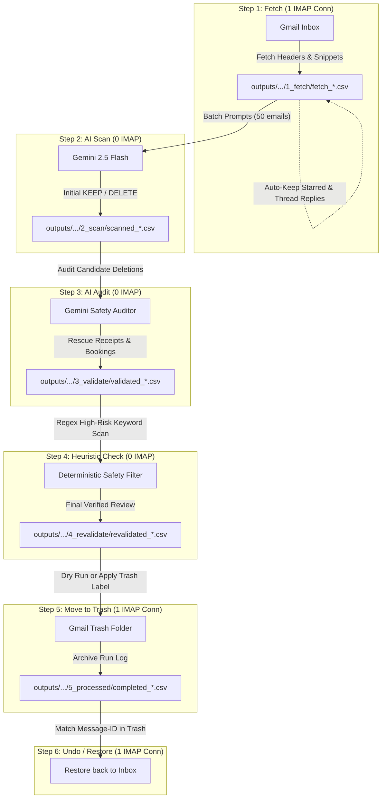

# 📧 Gmail AI Cleaner

> An intelligent, multi-stage Gmail cleaner powered by Google Gemini AI. Classify, audit, and clean thousands of marketing emails and spam with multi-layer safety defenses, zero IMAP connection lockouts, and 1-click restoration.

[](https://www.python.org/downloads/)
[](LICENSE)
[](https://ai.google.dev/)

---

## 🌟 Why Gmail AI Cleaner?

Most open-source email cleaning scripts are monolithic loops that crash when Gmail throttles their IMAP connections or when an LLM hallucinates and deletes an important receipt.

**Gmail AI Cleaner** solves this with a **decoupled, multi-stage artifact pipeline**:

* ⚡ **Decoupled Architecture**: IMAP network operations use **1 single persistent connection** (preventing Gmail's `[ALERT] Too many simultaneous connections` 15-connection ban). AI inference runs in parallel with **0 IMAP connections**.
* 🛡️ **Triple Safety Defense**:
  1. **Zero-Token Pre-Protection**: Starred emails (`\Flagged`) and conversational thread replies (`In-Reply-To` / `References`) are automatically kept without using any AI tokens.
  2. **LLM Safety Auditor**: A secondary AI auditor inspects all candidate deletions specifically to rescue receipts, order confirmations, tickets, and legal notices.
  3. **Heuristic Sanity Auditor**: A deterministic regex scanner catches high-risk keywords (OTPs, 2FA, banking alerts, flight reservations) before deletion.
* 📦 **Inspectable CSV Artifacts**: Every step produces an immutable, timestamped CSV artifact (`outputs/<account>/<step>/`). You can pause, review candidate deletions in Excel/Numbers, and resume at any time.
* 🔄 **1-Click Deterministic Undo**: Deletions only move emails to Gmail Trash (`\Trash`), never permanently expunging them. Step 6 (`make undo`) matches permanent RFC 822 `Message-ID`s and instantly restores emails back to your `\Inbox`.
* 👥 **Account Isolation**: Process multiple Gmail or Google Workspace inboxes without data collisions.

---

## 🏗️ Architecture Pipeline



---

## 📋 Prerequisites

1. **Python 3.9+** installed on your system.
2. **Google App Password**:
   - Enable [2-Step Verification](https://myaccount.google.com/signinoptions/two-step-verification) on your Google Account.
   - Go to [Google App Passwords](https://myaccount.google.com/apppasswords).
   - Enter `Email Cleaner` as the app name and generate a 16-character password (e.g. `abcd-efgh-ijkl-mnop`).
   - *Note: IMAP must be enabled under Gmail Settings -> Forwarding and POP/IMAP.*
3. **Gemini API Key**:
   - Get a free or pay-as-you-go API key from [Google AI Studio](https://aistudio.google.com/app/apikey).

---

## 🚀 Quickstart

### 1. Clone the repository
```bash
git clone https://github.com/robinsdeepak/email_cleaner.git
cd email_cleaner
```

### 2. Set up virtual environment & install dependencies
```bash
python3 -m venv .venv
source .venv/bin/activate   # On Windows: .venv\Scripts\activate
pip install -r requirements.txt
```

### 3. Configure credentials
Copy `.env.example` to `.env`:
```bash
cp .env.example .env
```
Open `.env` and fill in your details:
```env
GMAIL_USER=your_email@gmail.com
GMAIL_APP_PASSWORD=xxxx-xxxx-xxxx-xxxx
GEMINI_API_KEY=AIzaSy...
GEMINI_MODEL=gemini-2.5-flash
```

---

## 🛠️ Usage

### Option A: Using `make` (macOS / Linux)

```bash
# Run Steps 1-4 end-to-end (fetches, classifies, audits, and stops for review)
make run-all LIMIT=100

# Preview emails that would be deleted (Safe Simulation)
make dry-run

# Move confirmed emails to Gmail Trash
make delete

# Made a mistake? Undo and restore all emails back to Inbox
make undo
```

### Option B: Using the Python CLI directly (Windows / macOS / Linux)

```bash
# Run complete review pipeline (Steps 1 through 4)
python pipeline.py run-all --limit 100

# Preview candidate deletions
python pipeline.py dry-run

# Live delete (move to Trash)
python pipeline.py delete

# Undo deletion
python pipeline.py undo
```

---

## 🔍 Running Individual Steps

You can run any step independently. Each step automatically detects the latest artifact from the preceding step:

| Step | Command | Description |
| :--- | :--- | :--- |
| **1. Fetch** | `python pipeline.py fetch --limit 200` | Pulls headers & snippets from Inbox into `1_fetch/`. |
| **2. Scan** | `python pipeline.py scan --workers 10` | Parallel Gemini AI classification into `2_scan/`. |
| **3. Validate** | `python pipeline.py validate` | AI False-Positive Auditor rescues receipts into `3_validate/`. |
| **4. Revalidate** | `python pipeline.py revalidate` | Regex keyword scanner ensures zero sensitive deletes into `4_revalidate/`. |
| **5. Delete** | `python pipeline.py delete [--dry-run]` | Moves verified emails to Gmail Trash and logs to `5_processed/`. |
| **6. Restore** | `python pipeline.py undo [--dry-run]` | Searches Trash by `Message-ID` and restores emails to Inbox. |

---

## ⚙️ Configuration & Quotas

### Gemini API Rate Limits
* **Pay-As-You-Go (Recommended)**: 1,000 RPM / 4,000,000 TPM. You can run with `--workers 10` to scan thousands of emails in minutes.
* **Free Tier**: Capped at 15 RPM. Run with single worker to stay within free quotas:
  ```bash
  python pipeline.py scan --workers 1 --batch-size 50
  ```

### Multi-Account Support
Specify the target email address on any command:
```bash
python pipeline.py run-all --limit 200 --email alternate_account@gmail.com
```
Artifacts are automatically saved in `outputs/alternate_account_at_gmail_com/`.

---

## 🛡️ Safety & Privacy First

* **Local Execution**: Only email headers (From, Subject, Date) and short truncated snippets (~250 chars) are processed by Gemini. Full attachments and full HTML bodies are never parsed or sent.
* **No Permanent Loss**: Emails are **never expunged**. They are labeled with `\Trash` so they remain in your Gmail Trash folder for 30 days before Google automatically empties them.
* **Open Source & Auditable**: Inspect the generated CSVs at every step in `outputs/` before executing live deletion.

---

## 📂 Project Structure

```text
email_cleaner/
├── pipeline.py                 # Root CLI entrypoint (python pipeline.py ...)
├── pyproject.toml              # PEP 517/621 package specification
├── Makefile                    # Task runner
├── requirements.txt
├── src/
│   └── gmail_cleaner/
│       ├── config.py           # Environment variables & credential validation
│       ├── imap_client.py      # Dedicated IMAP SSL connection & header parser
│       ├── ai.py               # Gemini client, prompt templates & schema parser
│       ├── state.py            # Artifact paths, cursor state & account isolation
│       ├── cli.py              # CLI argument parsing & orchestrator
│       └── stages/             # Modular pipeline stages (01..06)
│           ├── 01_fetch.py     # Step 1: Safe single-connection IMAP fetch
│           ├── 02_scan.py      # Step 2: Parallel Gemini classification
│           ├── 03_validate.py  # Step 3: LLM False-Positive Safety Auditor
│           ├── 04_revalidate.py# Step 4: Heuristic regex sanity filter
│           ├── 05_delete.py    # Step 5: Apply deletion to Gmail Trash
│           └── 06_restore.py   # Step 6: 1-click Message-ID undo engine
├── tools/                      # Benchmark & rate-limit testing scripts
├── legacy/                     # Archived historical script
└── outputs/                    # Account-isolated CSV artifacts (gitignored)
```

---

## 📄 License

This project is licensed under the [MIT License](LICENSE).
